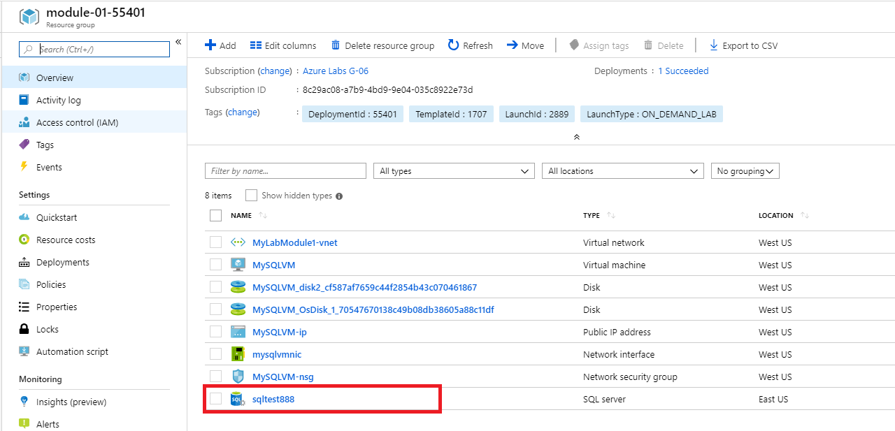
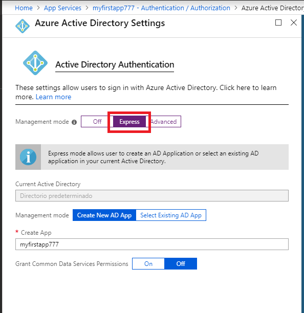

# LAB GUIDE
## Lab: App Modernization

### Pre-requisites
* Microsoft Azure Account: You'll need a valid and active Azure account for the Azure labs.


## Length
30 minutes

## Exercise 1: Migrate the database to Azure SQL Database


## Task 1: Provision a SQL Server
In this task, you will create a SQL Server (logical server). You will not create the databases at this time since it will be created during the database migration step

1. In a web browser, navigate to the Azure portal http://portal.azure.com and sign in with the credentials provided.
2. Select "+Create a resource", enter SQL Server into the Search the Marketplace box, press enter and select SQL Server (logical server) from the results.
   


3. Select Create on the SQL server (logical server) blade
4. On the SQL Server (logical server on...) blade, specify the following configuration:
-   a. Server name: Enter a unique value, such as SQLTESTXXX Where you must change the values for XXX, (ensure the green checkmark appears).
-   b. Server admin login: demouser
-   c. Password: Password.1!!
-   d. Resource group: Select the module-01-XXXXX resource group, Where XXXXX is the number assigned to your credentials.
-   e. Location: Select the nearest location to where you are.
   


5. Select Create.

## Task 2: Configure SQL Server firewall
In this task, you will create a firewall rule to allow access to your SQL Server

1. After the SQL Server finishes provisioning, navigate to it by select Resource groups from the left-hand menu in the Azure portal, then click on module-01-XXXXX resource group from the list.
   


2. Select your SQL Server from the resources in the group.
   


3. On the SQL Server blade, select Firewalls and virtual networks under Settings.
   


4. On the Firewalls and virtual networks blade, specify a new rule named ALL, with START IP 0.0.0.0, and END IP 255.255.255.255, then select Save
   


5. On the Success dialog box, select OK

## Task 3: Migrate the on-premises SQL database to Azure
In this task, you are going to create the AdventureTest database and migrate it from on-premises (Lab VM) into Azure SQL Database

1. On Azure Portal, From the Left menu, go to Virtual Machines.
 


3. Click on MySQLVM
   


4. On the VM’s Dashboard, click on Connect from the upper menu.
   


5. Click on Download RDP File.
   


6. Go to your downloads folder and double click on MySQLVM.rdp File, click on Connect, enter student as the username and Pa55.wrd1234 as Password, and click on Accept. Then click on Yes.
7. Click on Start Button and type Management, from the results click on SQL Management Studio 17, and then click connect.
8. Click on New Query


9. Type the following code and click on Execute

```
CREATE DATABASE AdventureTest
GO

USE AdventureTest
CREATE TABLE dbo.Products  
   (ProductID int PRIMARY KEY NOT NULL,  
   ProductName varchar(25) NOT NULL,  
   Price money NULL,  
   ProductDescription text NULL)  
GO
INSERT Products (ProductID, ProductName, Price)  
    VALUES (3000, 'Hammer', .52),
			(3001, 'Bag', 2),
			(3002, 'Spoon', .15),
			(3003, 'Knife', .15),
			(3004, 'Chainsaw', 13)  
GO

```


10. At object explorer, expand Databases and click on refresh until the AdventureTest Database appears

11. Right-click the AdventureTest database, select Tasks and then Deploy Database to Microsoft Azure SQL Database.


12.  In the Deploy Database ‘AdventureTest' dialog, select Next to begin.
13.  On the Deployment Settings tab, select Connect next to Server Connection.
   


14. In the Connect to Server dialog, enter the server name of the Azure SQL server you created previously. You can find this by navigating to your SQL Server in the Azure portal and selecting Properties.
   


15. Next, set Authentication to SQL Server Authentication and enter the following credentials:
   - a. Login: demouser
   - b. Password: Password.1!!
16. Check Remember password.
17. Select Connect.
   


18.  You should now see the Azure SQL server name in the Server connection box. Verify the new database name is AdventureTest, then, select Next.

19.  Verify the settings are correct and select Finish.
   


20. When the operation has completed, close the database deployment dialog. You should see green checkmarks next to each completed step, along with a large checkmark next to Operation Complete.
21. You can verify that the database is operational, and its tables populated by connecting to it through SSMS (SQL Server Management Studio), using the same credentials used in Step 15 above.


## Exercise 2: Provision App Services
## Task 1: Create a Web App
In this task, you will provision a Web App and API App in Azure.

1. In the Azure portal http://portal.azure.com, create a new Web App by selecting +Create a resource, type "web app" in the Marketplace search box, hit enter, and select the Web App item in the results.
   


2. Select Create on the Web App blade.
3. On the Web App Create blade, specify the following configuration:
  
-   a. Subscription: Select the subscription you are using for this lab.
-   b. Resource group: Select Use existing and select the resource group provided for this Module 1 lab.
-   c. Name: Enter a unique and valid URL, such as myfirstappXXX Where you must change the values for XXX (until the green check mark appears) in the App Name field.
-   d. Publish: Select Code.
-   e. Runtime stack: Select ASP.NET V4.7.
-   f. Operating System: Windows will be selected because of the runtime stack you selected.
-   g. Region: Choose the nearest region to where you are doing this lab.
   


-   h. Plan: Leave the default setting, note that if you dont have an App Service Plan it will be created
-   i. Sku and size: Ensure that Standard S1 is selected
   


4. You can click on Change size under Sku and size and review the details of every size offered, after that, click on the Production tier, select S1 and then click on Apply
   


5. Click on Next: Monitoring at the bottom of the page.
6. Disable the Application Insights
   


7. Select Review and create at the bottom of the page, and then click on Create

## Exercise 3: Connect your App with the Azure SQL Database

## Task 1: Get the connection String

1. On the azure portal, from the left menu, click on SQL databases
2. Select the AdventureTest Database you just migrated.
3. From the AverntureTest blade, click on Connection strings


4. Selec the ADO.NET connections string and click on the copy button, note that you will need to change the information with your username and password

 

## Task 2: Add the connection string to your Web App

1. On the Azure Portal from the left menu, click on App Services, and then click on the App you just created on Exercise 2


2. On the Web App blade, under settings click on Configuration, on the Connection Strings section click on + New connection string


3. On Connection String Name Type democs, on Value paste the connection string that you obtained on the past task, change the values from username and password with demouser and Password.1!!, On Type, select SQLAzure, then click on update at the bottom of the blade


4. NOTE: You can name the connection strings to match with the connection strings you use on your code.

5. On the Configuration Blade, click on Save


## Exercise 4: Identity and security

## Task 1: Protect your WebApp with Azure Identity.

1. In the Azure portal, navigate to the Web App you created on the Exercise 3 (Select, App Services in the left menu, and then your app). Under settings, select Authentication / Authorization
   


2. If Authentication / Authorization is not enabled, select On.
   


3. Under Action to take when request is not authenticated, select Log in with Azure Active Directory.
4. Under Authentication Providers, Select Azure Active Directory, and then select Express under Management Mode.
   


5. Select OK to register the App Service app in Azure Active Directory. This creates a new app registration. 
6. Click Save.

You are now ready to use Azure Active Directory for authentication in your App Service app.

## Task 2: Test the protection.
1. From the App Services Blade, click on Overview.
2. Under URL on the dashboard click on the link to test the Authentication you just Enabled.
3. Sign in with the azure account provided for this lab

Note that the web app you just created now is protected with Azure Active Directory Identity


End of the lab