# LAB GUIDE
## Lab: Implementing Containers on Azure VMs.

## Pre-requisites
* Microsoft Azure Account: You'll need a valid and active Azure account for the Azure labs.


## Length
30 minutes

## Before you begin
1. Enter in the following link <a href="http://portal.azure.com,">Portal Azure</a> and follow the next instructions

## Exercise 1: Implementing Docker hosts on Azure VMS

## Task 1: Connect to Azure Cloud Shell
1. In the Azure portal click the Cloud Shell icon.

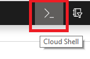

2. If you are presented with the Welcome to Azure Cloud Shell pane, click Bash (Linux). (If you've used the Cloud Shell before and it defaults to PowerShell, click the PowerShell drop-down and select Bash. Continue to Task 2)

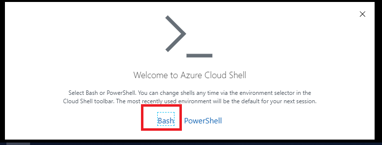

3. If you are presented with the You have no storage mounted message, click Show advanced settings

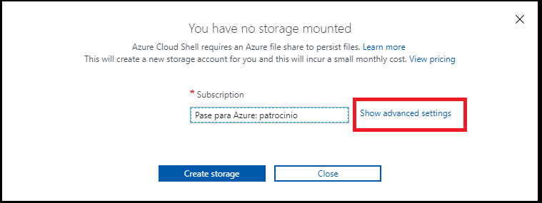

4.  In the resulting pane, specify the following settings and click Create storage:
- Subscription: ensure that the name of the target Azure subscription appears in the drop-down list
- Cloud Shell region: select the name of the Azure region that is available in your subscription and which is closest to the lab location
- Resource group: Select Use Existing and select the group Module-02-XXXX Where XXXX is a number generated for this lab.
- Storage account: ensure that Create new is selected and type a unique name of between 3 and 24 characters consisting of lower-case letters and digits
- File share: ensure that Create new is selected and type a unique name of between 3 and 63 characters consisting of lower-case letters, digits and dashes.

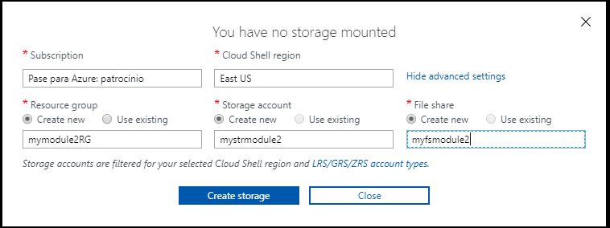

5. Wait for the deployment to be completed.
   
## Task 2: Create a new azure VM running Docker
1. In the azure portal, from the cloud shell, type the  following command which creates an SSH key pair using RSA encryption and a bit length of 2048:
```
ssh-keygen -t rsa -b 2048
```
2. The terminal requests the following values
```
 + Enter file in which to save the key (/home/demo/.ssh/id_rsa): Press enter to accept the default location
 + Enter passphrase (empty for no passphrase): Pa55word234234
 + Enter same passphrase again:Pa55word234234
```

3. Display your public key with the following command:
```
cat ~/.ssh/id_rsa.pub
```
4. Copy the displayed public key

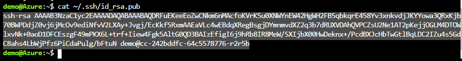

5. Deploy a template that will create a new Azure VM hosting Docker by typing the following command and pressing Enter, change the XXXXXX on the resource group to match with the number obtained from the lab environment, which will be on your credentials between odl_user_ and @:
```
az group deployment create --resource-group Module-02-XXXXX --template-uri https://raw.githubusercontent.com/Azure/azure-quickstart-templates/master/docker-simple-on-ubuntu/azuredeploy.json
```
6. The terminal requests the following values 
```
    + adminUsername: student
    + dnsNameForPublicIP: any valid, unique name consisting of lowercase letters and digits
    + adminPasswordOrKey: paste the public key obtained from step 4, and press enter
```
7. Wait for the deployment to be completed.

## Exercise 2: Deploying containers to Azure VMs
## Task 1: Connect to an Azure VM running Docker
1. In the Azure portal, in the Cloud Shell pane, identify the fully qualified domain name, again, please change the XXXXXX with the number generated for your lab.
```
FQDN=$(az vm show --resource-group Module-02-XXXXX --name myDockerVM --show-details --query [fqdns] --output tsv)
```
2. From the cloud shell identify the fully qualified name via which you can access the Azure VM by typing the following and pressing Enter:
```
echo $FQDN
```
3. From the Cloud Shell pane, establish an SSH session to the Azure VM by typing the following and pressing Enter:  

```
ssh student@$FQDN
```

4. The Cloud Shell will display a message informing you that the authenticity of the remote host cannot be established. This is expected. Type yes and press Enter to continue connecting
5. When prompted for the password, type Pa55word234234 and then press Enter. You should be presented with the student@MyDockerVM prompt.


## Task 2: Deploy a container to a Docker host running on an Azure VM
1. From the Cloud shell pane, within the SSH session to the Azure VM running Docker enter this command: 
 
```
docker run -d -p 80:80 --restart=always nginx
```
> **Note**: To configure the restart policy for a container, use the --restart flag when using the docker run command. The value always, Always restart the container if it stops.

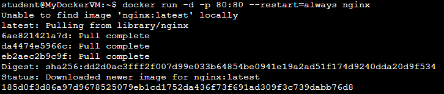

2. Check the process of the running container deployment with this command:
```
    docker ps
```
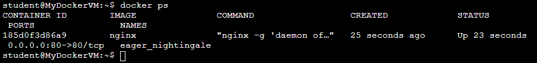

3. Start Microsoft Edge (or any browser) and browse to the URL matching the DNS fully qualified domain name you obtained in the previous task. Verify that the browser displays the Welcome to nginx! page

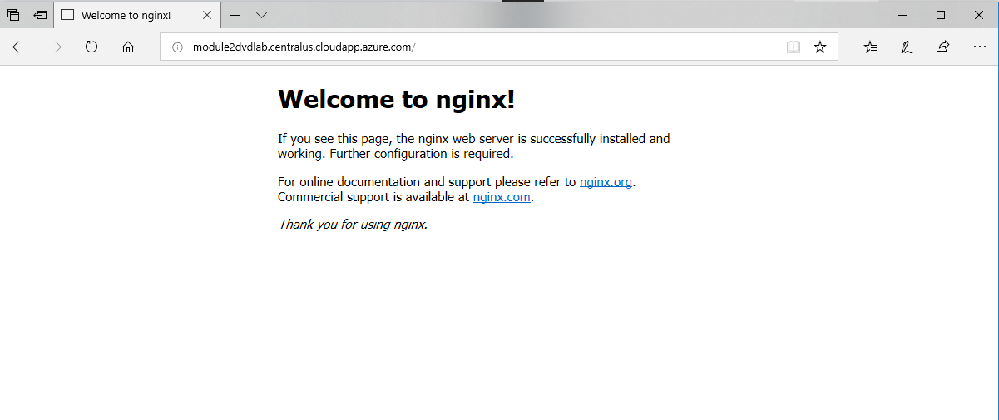


Once you completed this exercise, you have successfully run a sample containerized web server nginx on the Docker host Azure VM.

## Exercise 3: Deploying multi-container applications to Azure VMs with Docker Compose


## Task 1: Create a compose file
1. From the Cloud shell pane, within the SSH session to the Azure VM running Docker create a docker-compose.yml file by typing the following and then pressing Enter:  
```
nano docker-compose.yml
```
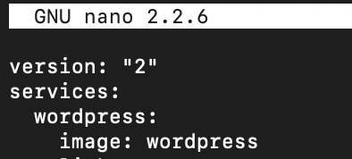

2. In the nano editor interface, type the following content
```
     version: "2"
     services:
       wordpress:
         image: wordpress
         links:
             - db:mysql
         ports:
             - 8080:80
       db:
          image: mariadb
          environment:
            MYSQL_ROOT_PASSWORD: yourpassword
```
Note: Be careful when typing the text above. Make sure you include the spaces to the left of the text (each indent should be a multiple of 2 spaces)

3. Once you typed in the text, press the Ctrl+O key combination and then press Enter.
4. Next, press the Ctrl+X key combination to exit the nano editor.

## Task 2: Deploy the containers with docker-compose to an Azure VM
1. From the Cloud shell pane, within the SSH session to the Azure VM running Docker, to deploy multi-container application defined on the previous task, type the following command:

```
   docker-compose up -d
```

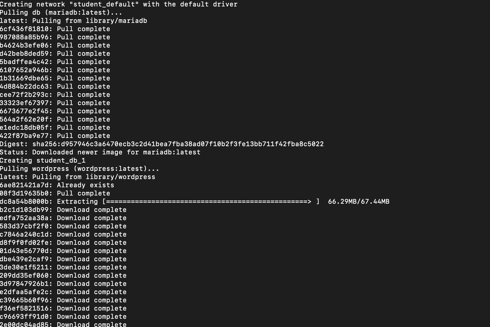

2. Check the progress of the container deployment
```
   docker ps 
```

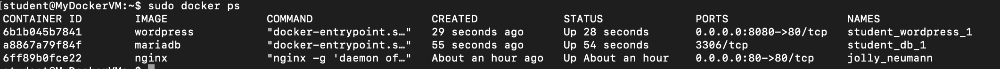

3. start Microsoft Edge and browse to the port 8080 on the target host using the same URL you used in the previous exercise. Verify that Microsoft Edge displays the initial Wordpress setup page.

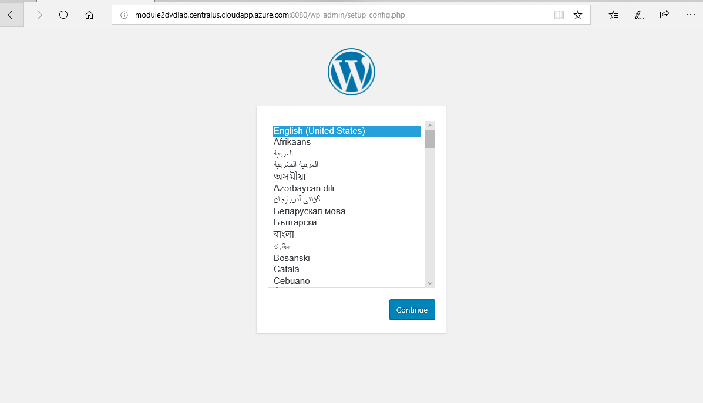

4. Type exit to terminate the SSH session and then close the Cloud Shell pane.

Result: Once you have completed this exercise, you have successfully implemented a multi-container application by using Docker Compose.