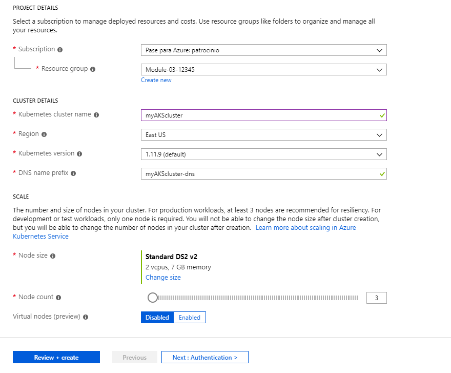
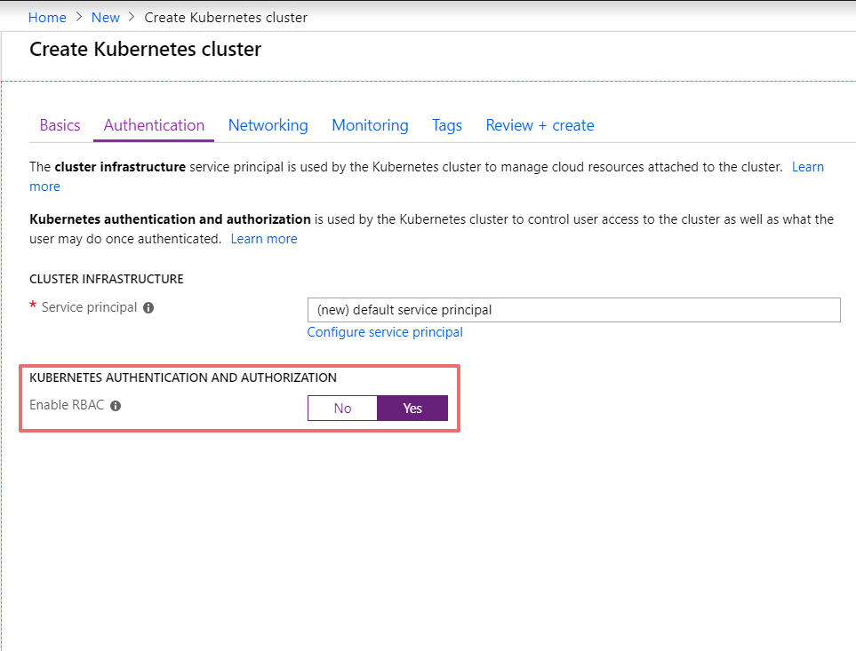
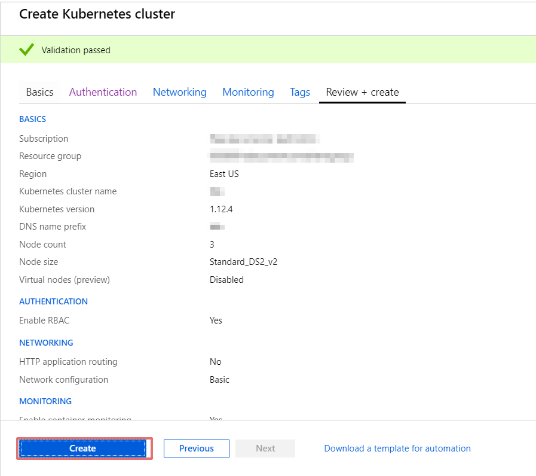
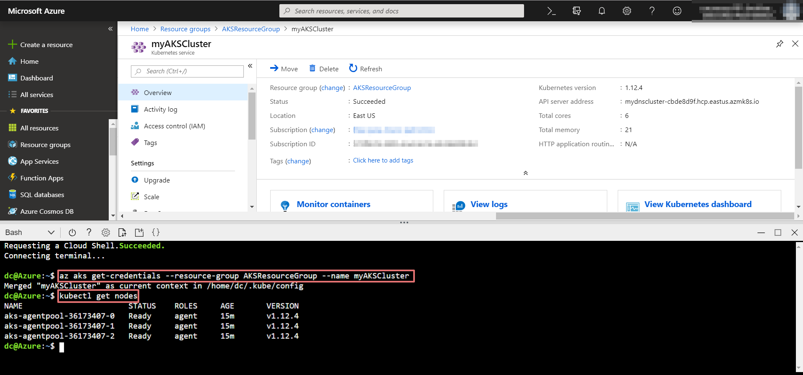
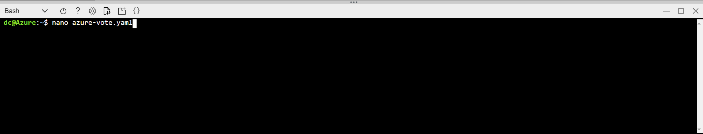
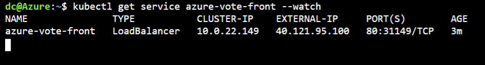

# LAB GUIDE
## Lab: Deploy an Azure Kubernetes Service (AKS) cluster using the Azure portal
## Learning Objectives
	- How to deploy an AKS cluster using the Azure portal.

## Pre-requisites
* Microsoft Azure Account: You'll need a valid and active Azure account for the Azure labs.

## Length
50 minutes

# Before you begin
1. Sign in into the <a href="https://portal.azure.com">Azure Portal</a> and follow the instructions


## Exercise 1: Create an AKS Cluster
1. First, click on **Create a resource** then click on **Kubernetes Service** button to initiate the configuration


2. Set the next options in **PROJECT DETAILS** and **CLUSTER DETAILS** sections and then click on **Next: Authentication >**

	- Subscription: Select the subscription you are using for this lab.
	- Version: Select the default version
	- Resource group: Select the Module-03-XXXXX resource group, where XXXXX is the number generated for this lab
	- Kubernetes cluster name: Enter a custer name, for example myAKScluster
	- DNS name prefix: This field its filled automatically when typing the cluster name, if not, set a DNS name prefix, for example myAKScluster-dns



3. Click on **Configure service principal** then check the **Use Existing**, On Service principal client ID, enter the Application/Client ID obtained for this lab, and in the Service principal client secret, enter the Application Secret Key obtained for this lab, this both settings could be founded at the screen presented at the beginning of the labs, then click on **Ok**


4. click on **Yes** on **Enable RBAC** option for Kubernetes role-based access controls (RBAC)



5. Go to Monitoring Tab and Set **No** for Enable container monitoring


6. click on **Review + create**, after Azure completes the review click on create



**note** It takes a few minutes to create the AKS cluster and to be ready for use. When finished, browse to the AKS cluster resource group, such as Module-03-XXXXX, and select the AKS resource, such as myAKSCluster. The AKS cluster dashboard is shown.


##task 2: Connect to the cluster
1. Click on the marked to open Cloud Shell
   


2. Write the next command to obtain the credentials to your Kubernetes cluster, replace the XXXXX on the resource group to match the with the number generated for your lab, and replace the myAKSCluster with the name you specified on the past task.
   
```
az aks get-credentials --resource-group Module-03-XXXXX --name myAKSCluster
```

3. Write the next command to configure kubectl to connect to your Kubernetes cluster

```
kubectl get nodes
```
**note** This command downloads credentials and configures the Kubernetes CLI to use them



## Exercise 2: Run the application

1. Write the next command to create a new file named **azure-vote.yaml**
```
nano azure-vote.yaml
```


**note** you can use **nano** or **vi** to create the file

2. Copy the next content and paste in your new file

```
apiVersion: apps/v1
kind: Deployment
metadata:
  name: azure-vote-back
spec:
  replicas: 1
  selector:
    matchLabels:
      app: azure-vote-back
  template:
    metadata:
      labels:
        app: azure-vote-back
    spec:
      containers:
      - name: azure-vote-back
        image: redis
        resources:
          requests:
            cpu: 100m
            memory: 128Mi
          limits:
            cpu: 250m
            memory: 256Mi
        ports:
        - containerPort: 6379
          name: redis
---
apiVersion: v1
kind: Service
metadata:
  name: azure-vote-back
spec:
  ports:
  - port: 6379
  selector:
    app: azure-vote-back
---
apiVersion: apps/v1
kind: Deployment
metadata:
  name: azure-vote-front
spec:
  replicas: 1
  selector:
    matchLabels:
      app: azure-vote-front
  template:
    metadata:
      labels:
        app: azure-vote-front
    spec:
      containers:
      - name: azure-vote-front
        image: microsoft/azure-vote-front:v1
        resources:
          requests:
            cpu: 100m
            memory: 128Mi
          limits:
            cpu: 250m
            memory: 256Mi
        ports:
        - containerPort: 80
        env:
        - name: REDIS
          value: "azure-vote-back"
---
apiVersion: v1
kind: Service
metadata:
  name: azure-vote-front
spec:
  type: LoadBalancer
  ports:
  - port: 80
  selector:
    app: azure-vote-front
```


2. Press ctrl+O
   


3. Press Enter
   


4. Press ctrl+X

5. Type the next command to deploy the application

```
kubectl apply -f azure-vote.yaml
```


**note** When you complete this exercise your application will be deployed

## Exercise 3: Test the application
1. Run the next command to monitor the progress
```
kubectl get service azure-vote-front --watch
```


**note** If **EXTERNAL-IP** is **pending** wait until the value changes to an actual **public IP**

2. When the **EXTERNAL-IP** address changes from pending to an actual public IP address, use ``CTRL+C`` to stop the **kubectl** watch process
   
3. Open a new tab on you browser, enter your external-IP, and you'll see your service running


**note** your application is now online

4. Close the Cloud Shell Window.


End of the lab